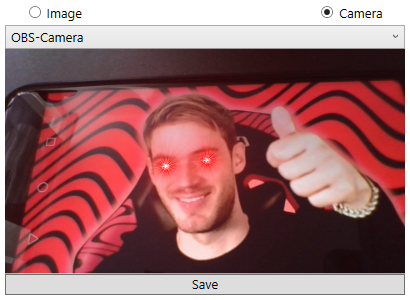
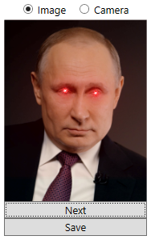
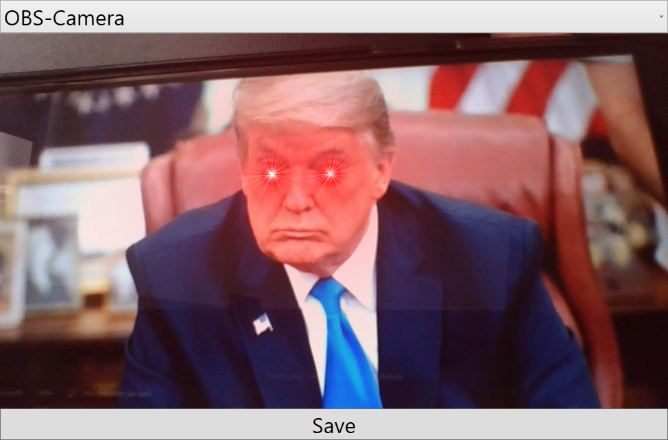
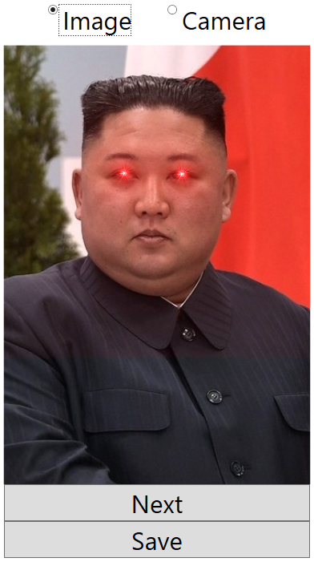

# RedEye   
At first this was a Project for learning ML.NET but I ended up not using it at all because Emgu.CV worked way better and easier.

If you want to try your own images, then place them in `bin\assets\examples` in your installation folder.

# Configuration
If you want to change any settings, then edit the `RedEye\config.csv` in your Documents folder.
| Setting                  | Description                                                                                                                                                                                                            |
|--------------------------|------------------------------------------------------------------------------------------------------------------------------------------------------------------------------------------------------------------------|
|     `StartWithCamera`    | Set if you want to start with camera when the program loads up (or with images). `true \| false`                                                                                                                       |
| `EyeImageVerticalOffset` | Moves the Red-Meme-Texture down by this amount. `Integer`                                                                                                                                                              |
|   `DetectionFrequency`   | How often the programs tries to detect your eyes per second (this is automatically capped at your cameras framerate and if you set this too high, the program might crash). `Integer > 0`                              |
|        `Neighbors`       | Basically: How precise should the detection be. If you set it too high, it won't detect anything and if you set it too low, it might detect other things as eyes (use very small numbers, like 1 or 2). `Integer >= 0` |
|       `PickAverage`      | Basically: It detects mutliple things as eyes and if you set this to true it will place the Meme-Texture over the average of every found eye location (I suggest `false`). `true \| false`                             |
|     `DrawRectangles`     | Set if you want to draw rectangles over the areas where the program found your eyes (if you set this to `true`, then you probably want to lower `DetectionFrequency`). `true \| false`                                 |
|          `Cuda`          | **DOESN'T WORK!** Set wether you want GPU acceleration. `true \| false`                                                                                                                                                 |
|   `ScreenshotLocation`   | Set the Full-Path to a folder where you want your screenshots to be saved (Folder should exist). `Text`                                                                                                                |

# Examples
 

 

# Sources
* [Emgu.CV](http://www.emgu.com/wiki/index.php/Main_Page)
* [Example Faces](http://vis-www.cs.umass.edu/lfw/)
* [Aforge](http://www.aforgenet.com/) for capturing webcams
